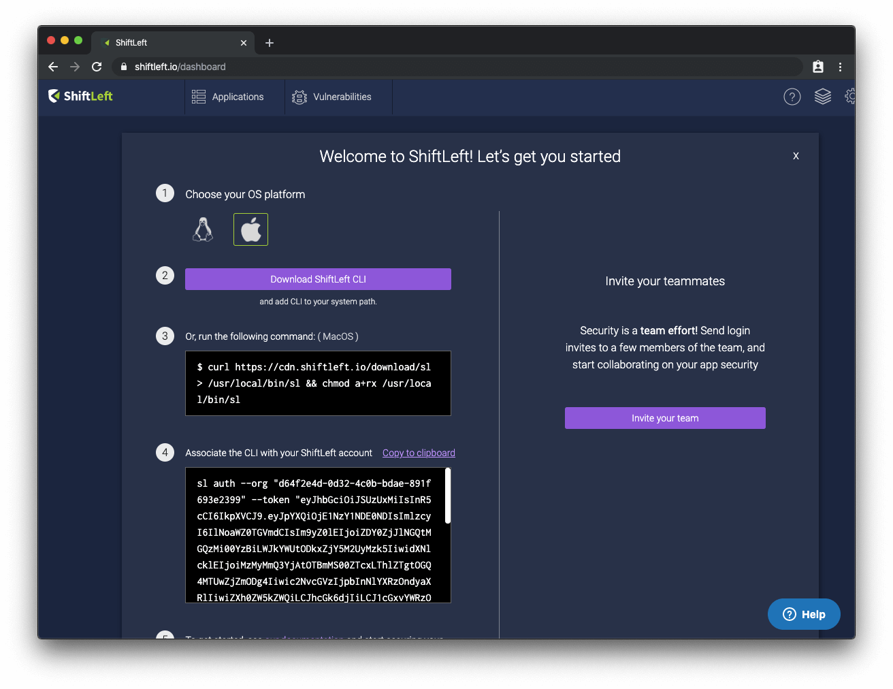

# Quickstart for Linux and macOS Users

This tutorial shows you how to install, set up, configure, and run your first code analysis using ShiftLeft.

## Register for a ShiftLeft Account

[Register](shiftleft.io/register) for a ShiftLeft account.

You will be prompted to create an organization. Provide a name for your organization and click **Create Organization** to proceed.

## Install ShiftLeft

As a new ShiftLeft user, you will be presented with a list of steps that you need to complete to install and set up ShiftLeft in the [Dashboard](https://www.shiftleft.io/dashboard).



You can always return to this page at a later date by clicking **Add App** in the Dashboard.

Begin by selecting the operating system you are using (in this case, select macOS); this will update the command-line code samples ShiftLeft provides you in the following steps.

Next, install the ShiftLeft CLI. You can do this in one of two ways:

1. Downloading the ShiftLeft CLI and manually adding the CLI to your system path.

2. Running the provided command-line command to download and adjust the permissions for the CLI:

```bash
$ curl https://cdn.shiftleft.io/download/sl > /usr/local/bin/sl && chmod a+rx /usr/local/bin/sl
```

Once you have the ShiftLeft CLI installed, you need to associate the CLI with your ShiftLeft account. The specific command you need is provided in the Dashboard, and it follows this format:

```bash
$ sl auth --org "YOUR_ORG_ID" --token "YOUR_ACCESS_TOKEN"
```

This step accomplishes two things: link the CLI running on your machine with your ShiftLeft account using ShiftLeft's API (the token included is needed to call the API).

## Inspect Your Code

At this point, you are ready to run Inspect. For this tutorial, we test HelloShiftLeft, a demo app built using Java to demonstrate how ShiftLeft works. **You must have the Java 8 SDK installed to use HelloShiftLeft.**

To get ShiftLeft, you can clone [its repo](https://github.com/ShiftLeftSecurity/HelloShiftLeft) by running `git clone https://github.com/ShiftLeftSecurity/HelloShiftLeft.git` in the Terminal/Bash.

Build the app using [Maven](https://maven.apache.org/install.html) by running `mvn clean package` (you can also use another build tool of your choice). You can expect the “BUILD SUCCESS” message to be printed to the Terminal/Bash if this is successful).

To inspect the code for HelloShiftLeft, run `sl analyze --app HelloShiftLeft --java target/hello-shiftleft-0.0.1.jar`. You will see the following output:

```bash
Results:
[INFO] initialized gRPC logging connection to api.shiftleft.io:443
libplugin version 0.4.41 (3d83753791c5a7b2c0e59aacff08125f69b73b41)
libplugin version 0.4.41 (3d83753791c5a7b2c0e59aacff08125f69b73b41)
Shiftleft CLI 2019-12-17T20:59:56.516Z Copying Target File /Users/katie/HelloShiftLeft/target/hello-shiftleft-0.0.1.jar
[INFO] Uploading to secure tenant namespace
[INFO] Result file is /var/folders/8t/z2j0nr8x73v1lpjn3ng4wwjm0000gp/T/shiftleft-089857555/output/HelloShiftLeft430968810
[INFO] Uploading to secure tenant namespace

31.85 MB / 31.85 MB [===================================] 100.00% 10.73 MB/s 2s

Saved config to shiftleft.json
... Done. Submitted for analysis
Wait for 5-10 minutes and load the following URL in your browser:
https://www.shiftleft.io/apps/HelloShiftLeft?organizationId=d64f2e4d-0d32-4c0b-bdae-891f693e2399
```

Per the instructions printed to the Terminal/Bash, open up the URL provided after 5-10 minutes have elapsed. This brings you to the Dataflows page; in the top right-hand corner, click Vulnerabilities to see the issues present in your code.
