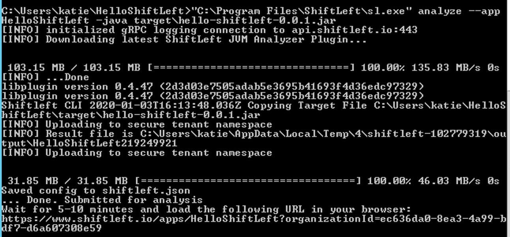

# Quickstart for Windows Users

This tutorial shows you how to install, set up, configure, and run your first code analysis using ShiftLeft.

## Register for a ShiftLeft Account

[Register](shiftleft.io/register) for a ShiftLeft account.

You will be prompted to create an organization. Provide a name for your organization and click **Create Organization** to proceed.

### Your Org ID and Access Token

As a new ShiftLeft user, you will be presented with a list of steps that you need to complete to install and set up ShiftLeft in the [Dashboard](https://www.shiftleft.io/dashboard).


You can always return to this page at a later date by clicking **Add App** in the Dashboard.

## ShiftLeft Installers for Windows

ShiftLeft provides the following installers for Windows users:

| Installer | Products Installed |
| - | - |
| [.NET Core](https://cdn.shiftleft.io/download/installer-dotnet-core-latest-windows-x64.zip) | Inspect only |
| [.NET Framework](https://cdn.shiftleft.io/download/installer-dotnet-framework-latest-windows-x64.zip) | Inspect and Protect |

You must use an account with administrator privileges to use the Windows installers.

## How to Install ShiftLeft

You can install ShiftLeft by downloading the installer via PowerShell or by going to the appropriate link.

### Obtain the Installer via Powershell

To get the .NET Core installer:

```text
Invoke-WebRequest -URI https://cdn.shiftleft.io/download/installer-dotnet-core-latest-windows-x64.zip -UseBasicParsing -OutFile sl-latest-windows-x64.zip
```

To get the .NET Framework installer:

```text
Invoke-WebRequest -URI https://cdn.shiftleft.io/download/installer-dotnet-framework-latest-windows-x64.zip -UseBasicParsing -OutFile sl-latest-windows-x64.zip
```

#### Installation Options

If you choose to run the installer from the command line, note that the installer binaries have the following command-line options available to modify the default behavior.

| Option | Description|
| - | - |
| `--no-prompt` | Disables prompts for non-interactive usage if you are running the installer from the command line |
| `--install-directory` | Specifies the installation directory; the default is `ShiftLeft` in the Windows Programs folder |
| `--start-menu-entries` | Sets the directory for the location of created Start menu items. Defaults to `ShiftLeft` at the top level of the Start menu. If empty, no Start menu items are created |
| `--sl-home` | Identifies the home directory for ShiftLeft products. This directory is created as part of the installation process, and stores any downloaded binaries and configuration files. Defaults to `.shiftleft` in your Home directory |
| `--no-dotnet-agent` | Installs just ShiftLeft Inspect (i.e. `sl.exe`) and not ShiftLeft Protect |

All directories are stored in the Windows Registry.

### Download Links for the ShiftLeft Installers

* [.NET Core](https://cdn.shiftleft.io/download/installer-dotnet-core-latest-windows-x64.zip)

* [.NET Framework](https://cdn.shiftleft.io/download/installer-dotnet-framework-latest-windows-x64.zip)

### Working with the ShiftLeft Installer

Once you've obtained the installer, unzip the downloaded file.


**Note:** For Protect, the installer bundles all of the dependencies into a single downloadable file. This enables the installer to run without needing access to the Internet.

Run the newly-unzipped executable to begin the installation process.

In the prompt that appears, grant the permissions requested by the installer.

Provide the installer with any requested permissions.


At this point, the installer copies `sl.exe` to `C:\Program Files\ShiftLeft`. If you are installing Inspect and Protect, you can find the latter in `C:\shiftleftDotNetAgent`.

During the installation process, you will see status updates in a Command Prompt window. Once the process completes, press `Enter` to finish and close out of the window.


## Using the ShiftLeft CLI to Authenticate

The ShiftLeft CLI command `sl auth` is used to authenticate with ShiftLeft and associate your applications with your organization.

```text
sl auth --org "YOUR_ORG_ID" --token "YOUR_ACCESS_TOKEN"
```

You can get the values for `YOUR_ORG_ID` and `YOUR_ACCESS_TOKEN` from the ShiftLeft [Dashboard](https://www.shiftleft.io/dashboard) under **Add App**.

This step accomplishes two things: link the CLI running on your machine with your ShiftLeft account using ShiftLeft's API (the token included is needed to call the API).

You can confirm or update your auth values at any time by reviewing the configuration file located at `C:\Users\{USER}\.shiftleft\config.json`.

## Inspect Your Code

At this point, you are ready to run Inspect. For this tutorial, we test HelloShiftLeft, a demo app built using Java to demonstrate how ShiftLeft works. **You must have Java 8 installed to use HelloShiftLeft.**

To get ShiftLeft, you can clone [its repo](https://github.com/ShiftLeftSecurity/HelloShiftLeft) by running `git clone https://github.com/ShiftLeftSecurity/HelloShiftLeft.git` in the Command Prompt.

Once you've cloned the repo, navigate into the folder by running `cd HelloShiftLeft`.

Build the app using [Maven](https://maven.apache.org/install.html) by running `mvn clean package` (you can also use another build tool of your choice). You can expect the “BUILD SUCCESS” message to be printed to the Command Prompt if this is successful).

Run ShiftLeft using `"C:\Program Files\ShiftLeft\sl.exe" analyze --app HelloShiftLeft --java target/hello-shiftleft-0.0.1.jar`. You will see the following output:



Per the instructions printed to the Terminal, open up the URL provided after 5-10 minutes have elapsed. This brings you to the Dataflows page; in the top right-hand corner, click Vulnerabilities to see the issues present in your code.
