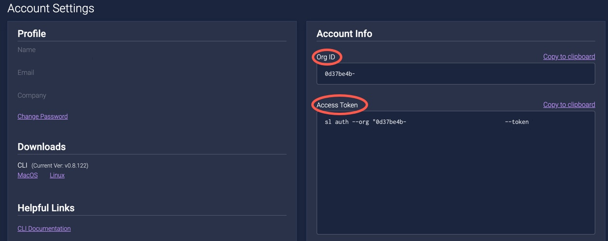

# Authenticating with ShiftLeft

To use ShiftLeft products, you must first authenticate with ShiftLeft. There are two methods for authenticating, by using:

- [Authenticating with ShiftLeft](#authenticating-with-shiftleft)
  - [Using the ShiftLeft CLI to Authenticate](#using-the-shiftleft-cli-to-authenticate)
  - [Using Environment Variables to Authenticate](#using-environment-variables-to-authenticate)
  - [Checking the Environment](#checking-the-environment)

The first time you log into ShiftLeft, if you are running ShiftLeft on either Linux or MacOS X, you obtain your authentication credentials (organization ID and access token) from the **Welcome** page of the ShiftLeft Dashboard. 

   

Subsequently, you can obtain your credentials from the **Account Settings** page of the ShiftLeft Dashboard.

   

Once authenticated, the ShiftLeft CLI creates the local file `$HOME/.shiftleft/config.json` for Linux and MacOS X and `%HOME%/.shiftleft/config.json` for Windows. This file contains your Organization ID and Access Token, and is required by the ShiftLeft CLI. For Linux and MacOS X, if the `$HOME` environment variable is not set locally, the CLI uses the path `/etc/shiftleft/config.json`.

## Using the ShiftLeft CLI to Authenticate

The ShiftLeft CLI command `sl auth` is used to authenticate with ShiftLeft and associate your applications with your organization.

When you run `sl auth` without any arguments you are prompted for the credentials:

* ShiftLeft **Organization ID**
* ShiftLeft **Access Token**

Alternatively you can use `sl auth --org "$ORG" --token "$TOKEN"` with the same values.

## Using Environment Variables to Authenticate

If you are using a CI/CD tool to submit applications to ShiftLeft Inspect for analysis, create the following environment variables to automate the authentication process: 

Environment variable for **Organization ID**:
- Name: `SHIFTLEFT_ORG_ID`
- Value: `{org-id-string}`

Environment variable for **Access Token**:
- Name: `SHIFTLEFT_ACCESS_TOKEN`
- Value: `{access-token-string}`

Note that the Upload Token was replaced by the Access Token in `sl --version` v0.7.1030. For `sl --version` prior to v.0.7.1030 please upgrade or use 

Environment variable for **Upload Token**:
- Name: `SHIFTLEFT_UPLOAD_TOKEN`
- Value: `{upload-token-string}`

## Checking the Environment

After authenticating with ShiftLeft, check your environment by running `sl check-environment`.

The Check Environment feature provides you with information, including:

* Operating system name and version
* Whether your ShiftLeft config exists
* Your network connectivity (e.g., whether you can reach the CDN and APIs)
* The ShiftLeft artifacts on your machine

You can also check your environment for language-specific configurations by running `sl check-environment [command options]`

ShiftLeft accepts the following values as command options:

| Command Option | Option Configuration to Check |
| - | - |
| --jvm | JVM |
| --dotnet | .NET |
| --js | JavaScript |
| --go | Go |
| --ocular | Ocular |

For example, if you run Check Environment with the `--jvm` flag, you will see information related to your Java installation at the bottom of your output:

```text
==== JAVA ====
java version "10.0.1" 2018-04-17
Java(TM) SE Runtime Environment 18.3 (build 10.0.1+10)
Java HotSpot(TM) 64-Bit Server VM 18.3 (build 10.0.1+10, mixed mode)
JDK: ✓ exists
```

You can check for multiple language-specific configurations by including multiple command options (e.g., `sl check-environment --jvm --go`).