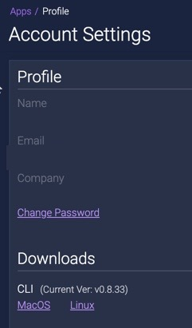

# Installing the ShiftLeft Command Line Interface (CLI)

The ShiftLeft CLI is named `sl`. There are two methods for downloading the ShiftLeft CLI installer: 

* [From the ShiftLeft Dashboard](#from-the-shiftleft-dashboard) (only Linux or MacOS X operating systems).
* [Using the command line](#using-the-command-line). 

The benefit of using the command line is that the ShiftLeft CLI automatically updates so that you don't have to reinstall the CLI whenever there are new features or fixes.

The ShiftLeft CLI is invoked using the following syntax:

```
sl [global options] command [command options] [arguments...]
```

Once you have installed the ShiftLeft CLI, make sure you have [authenticated the CLI with your ShiftLeft Account](../using-cli/authenticating.md). 

Refer to the [CLI Reference](cli-reference.md) for information on using the CLI.

## From the ShiftLeft Dashboard

You can use the ShiftLeft Dashboard to download the ShiftLeft CLI installer only if you are running ShiftLeft on either the Linux or MacOS X operating systems. 

The first time you log into ShiftLeft, you can download the ShiftLeft CLI from the [Welcome page](https://www.shiftleft.io/dashboard) by clicking the Download the ShiftLeft CLI button.

   
   
Or you can download the ShiftLeft CLI anytime from the Profile page > Downloads section. Click on the operating system that you are using.

  

Once you have downloaded the ShiftLeft CLI installer, add the CLI to your system path. The process is different for each operating system, as explained below.

You can verify the CLI installation by typing `sl help`.

### Adding the CLI to your System Path for Linux and MacOS X

Make sure that `/usr/local/bin` is in your `$PATH`.

Extract the `sl` or `sl.exe` binary and then add the directory location of the `sl` binary to your `$PATH` (or manually copy it to `/usr/local/bin`).

### Adding the CLI to your System Path for Windows .NET

Note that for Windows .NET there are two variants: .NET Framework and .NET Core. Make sure to pick the right variant for your project.

After you have downloaded the appropriate installer, unzip the file and invoke the installer. If you are running the installer from the terminal, add `--no-prompt` to disable waiting for user input.

## Using the Command Line

The process is different, depending on your operating system.

The ShiftLeft CLI automatically updates so that you don't have to reinstall the CLI whenever there are new features or fixes (`curl` or `wget` are required for automatic updates). You can disable automatic updating by setting the environment variable `SHIFTLEFT_NO_AUTO_UPDATE=true` when running `sl`.

You can verify the CLI installation by typing `sl help`.

### Linux and MacOS X

Use the command

```
curl https://cdn.shiftleft.io/download/sl >/usr/local/bin/sl && chmod a+rx /usr/local/bin/sl
```

### Windows .NET Framework

In PowerShell, you can issue the following command to download an installer that enables the ShiftLeft CLI and ShiftLeft Protect for .NET Framework

```
Invoke-WebRequest -Uri https://cdn.shiftleft.io/download/installer-dotnet-framework-latest-windows-x64.zip -UseBasicParsing -OutFile sl-latest-windows-x64.zip
```
Alternatively, you can use a browser to download the file.

### Windows .NET Core

In PowerShell, you can issue the following command to download an installer that enables the ShiftLeft CLI

```
Invoke-WebRequest -Uri https://cdn.shiftleft.io/download/installer-dotnet-core-latest-windows-x64.zip -UseBasicParsing -OutFile sl-latest-windows-x64.zip
```
Alternatively you can use a browser to download the file.
