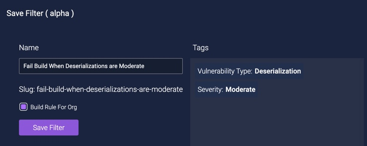

# Failing a Build Based on Analysis Results

A build in your CI-CD pipeline can be automatically failed based on ShiftLeft Inspect's code analysis results. For example you may want to fail a build that has 

* A specific number of vulnerabilities.

* At least one occurrence of a specific type of vulnerability in the source code.

Failing a build involves creating a build rule for your organization, and then using the ShiftLeft API to verify whether an analysis result passes or fails based on the build rule. 

**To fail a build:**

1. [Create a filter that defines the fail criteria](../using-dashboard/filter-results.md#creating-a-filter).
2. [Save the filter](../using-dashboard/filter-results.md#saving-a-filter).
3. In the Save Filter dialog, check **Build Rule for Org**.

     

4. Use the following bash script, which invokes ShiftLeft's public API. 
   The script shows 1 for success if the ShiftLeft Inspect results don’t have any vulnerabilities that match the build rule criteria. The script shows 0 for failure, if the build has vulnerabilities that match the build rule criteria.
 
```bash
#!/bin/sh

set -e

#Insert your public token here, as provided by ShiftLeft UI (user profile view with feature flag ?publicApiToken=enable)
PUBLIC_TOKEN=`cat token.txt`

#Insert your organization ID as provided in the ShiftLeft UI
ORGID='-----------------------------------'
#Insert your application ID as provided in the ShiftLeft UI
APPID='----------'

#We're assuming this is the "tag_key=tag_value" use case "branch=branch_name"
TAG_KEY='branch'
TAG_VALUE=$1

SL_PROTO='https'
SL_HOST='www.shiftleft.io'
SL_URL="$SL_PROTO://$SL_HOST/api/v3/public/org/$ORGID/app/$APPID/tag/$TAG_KEY/$TAG_VALUE/build"
BEARER='Authorization: Bearer '$PUBLIC_TOKEN
BUILD_RESULT=$(curl --fail --show-error -X GET \
   $SL_URL \
  -H 'Accept: */*' \
  -H "$BEARER" \
  -H 'Cache-Control: no-cache' \
  -H 'Connection: keep-alive' \
  -H "Host: $SL_HOST" \
  -H 'accept-encoding: text/plain, deflate' \
  -H 'cache-control: no-cache' \
  -H 'cookie: Cookie_3=value' \
  -s -b Cookie_3=value)

echo $BUILD_RESULT

SUCCESS=$(echo $BUILD_RESULT | grep "success")
if [ -z "$SUCCESS" ]; then
    exit 1;
fi
exit 0
```
