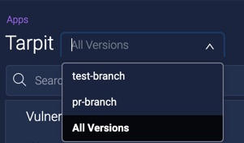

# Identifying Branch Names in ShiftLeft Inspect

You can include branch names in the analysis results of ShiftLeft Inspect. Doing so ensures that the automated analysis by ShiftLeft Inspect of these branches does not get mixed up with the analysis of the main branch. It also allows you to view analysis results of individual branches separately.

**To include branch information in ShiftLeft Inspect:**

1. Obtain the branch name from your SCM system. For example, for git, you can use `git rev-parse --addrev-ref HEAD`.
2. Add the branch name to your automated ShiftLeft Inspect script.

```
sl analyze --tag branch=<branchname> --app <appname> <JAR file path>
```

The branch name becomes available from your application's [Vulnerabilities Dashboard Versions drop-down menu](../using-dashboard/view-results.md#displaying-results-by-branch-name).

   
