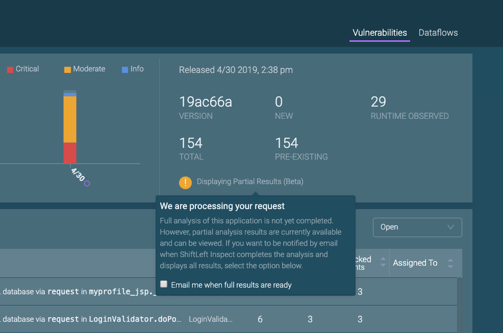
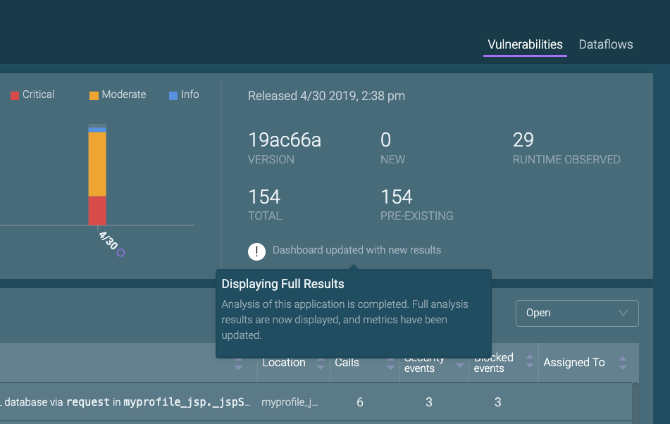
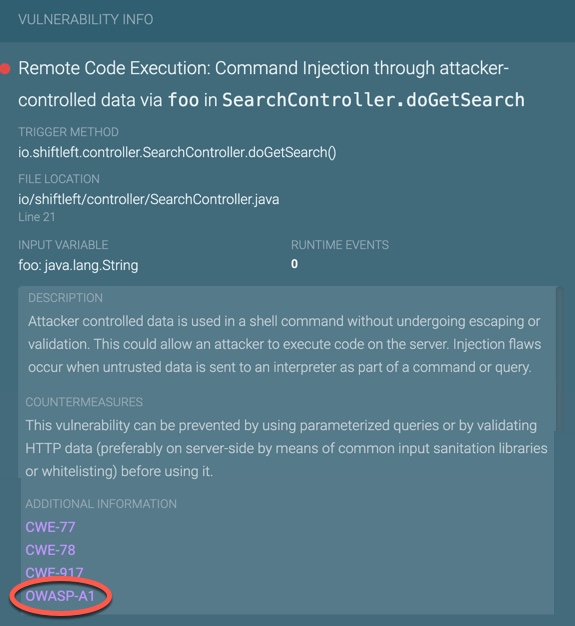

# Viewing Analysis Results

Information is provided on 

* [Analysis Results Notification](#analysis-results-notification)
* [Identifying and Getting Additional Information on Top OWASP and SANS Vulnerabilities](#identifying-and-getting-additional-information-on-top-owasp-and-sans-vulnerabilities)

## Analysis Results Notification

The first time you submit an application, or if your application has major library changes, it may take ShiftLeft Inspect a day or two to complete a full analysis. In those situations, ShiftLeft Inspect initially displays the partial analysis results, which is indicated by a message on the application's card and in the Vulnerabilities Dashboard. 

 

From this message, you can specify that you want to receive notification when the full analysis results are available. Just check the box to **Email me when full results are ready**. 

Once ShiftLeft Inspect completes the analysis, the message changes to indicate that the full analysis results are now displayed and all metrics have been updated.

## Identifying and Getting Additional Information on Top OWASP and SANS Vulnerabilities

The [Open Web Application Security Project (OWASP)](https://www.owasp.org/index.php/Category:OWASP_Top_Ten_Project) and [SANS](https://www.sans.org/top25-software-errors/) organizations provide information on the most widespread and critical errors that can lead to serious security vulnerabilities in your software. 

Vulnerabilities found by ShiftLeft Inspect that are either OWASP Top 10 or the SANS Top 25 are identified as such in the Additional Information section of the [Vulnerability Description](../using-workflow/vulnerability-dashboard.md). You may need to scroll down to see the Additional Information section. 

Clicking on the tag displays, in a seperate tab, specific information on this vulnerability from the appropriate organization.
