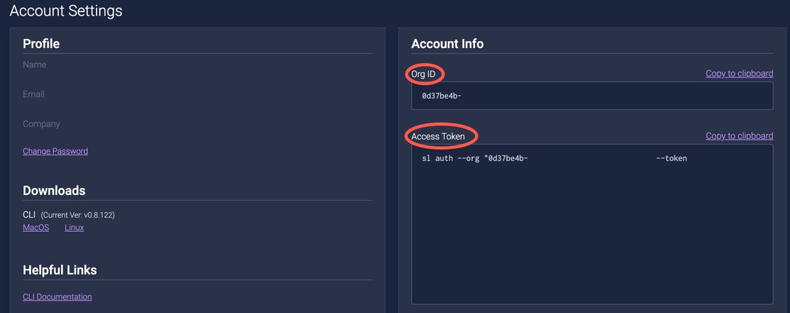

# Integrating with GoCD

GoCD is an open source CD tool. To integrate GoCD with ShiftLeft Inspect, you need to create a script file as part of the build project. With GoCD, all builds occur on agents: either containers or instances. 

The process of integrating GoCD with ShiftLeft Inspect is.

1. [Install the ShiftLeft Command Line Interface (CLI)](#install-shiftleft-cli).
2. [Copy the SL binary to the agent image](#copy-the-sl-binary-to-the-agent-image).
3. [Configure the build](#configure-the-build).


## GoCD Integration Prerequisites

The prerequisites for integrating GoCD application builds are:

- [GoCD installation](https://www.gocd.org/download/#osx).
- [ShiftLeft requirements](../../introduction/requirements.md).
- Familiarity with [ShiftLeft Inspect](../../using-inspect-protect/inspect-protect-quick-start.md).
- ShiftLeft account credentials: **Organization ID** and **Access Token**. When you first log into ShiftLeft, these credentials are provided. Once you have established your account, you can obtain your Organization ID and Access Token from the [**Account Settings** page of the ShiftLeft Dashboard](https://www.shiftleft.io/user/profile).




## Install ShiftLeft CLI

To install the ShiftLeft CLI:

1. [Install the ShiftLeft CLI](../using-cli/install-cli.md) on the host where GoCD server is installed.
2. [Authenticate with ShiftLeft](../using-cli/authenticating.md).
2. Log in to GoCD server as an administrator. 
3. Create the following **Environment variables**
 * Name: `SHIFTLEFT_ORG_ID`| Value: <**Organization ID**>
 * Name: `SHIFTLEFT_ACCESS_TOKEN`| Value: <**Access Token**>

## Copy the SL Binary to the Agent Image

To copy the SL binary to the agent image

1. Go into a particular GoCD agent image and add the `sl` binary to the agent path at `/usr/local/bin`.
2. Use a terminal editor to add a shell script that consists of these two lines

   ```bash
   #!/bin/sh

   /usr/local/bin/sl analyze
   ```

   Or use the CPG mode for analysis

   ```bash
   #!/bin/sh

   /usr/local/bin/sl analyze --cpg
   ```

3. Check this shell file into the project's repository.

## Configure the Build

Once you have checked in the shell script:

1. Go to the project itself.
2. Click the gear icon or **Settings**.
3. Go to **Stages** tab.
4. Add a new Stage.
- Stage Name: **SL Analyze**
- Trigger Type: **On Success**
- Job Name: **SL Analyze** 
- Task Type: **More**
- Command: **/bin/sh**
- Arguments: `/path/to/script/you/checked/in.sh`
- Working Dir: `/directory/where/built/project/packages`
