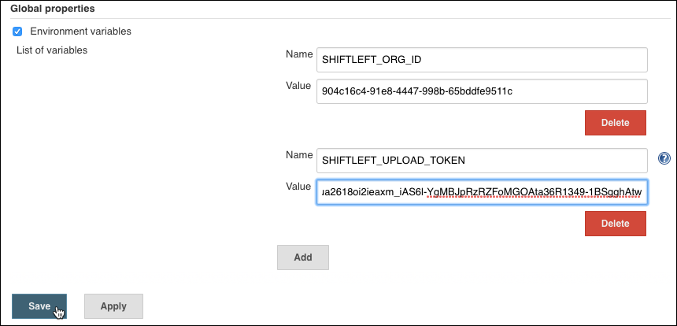

# Integrating with Jenkins

Jenkins is an open source automation server used in the CI process. You can integrate your Jenkins project with ShiftLeft Inspect for automated code analysis. To do so, configure each Jenkins project to execute the ShiftLeft Inspect shell command [`sl analyze`](../../inspect/analyzing-applications.md).

[A video](https://youtu.be/bI1GATsD5mc) demonstrates how to integrate ShiftLeft with an existing Jenkins freestyle project using the [final build step](configure-final-build-step.md) method.

## Jenkins Integration Options

There are two ways to integrate with Jenkins: by configuring a final build step, or a post build task, for **each** Jenkins project you want to submit for analysis to ShiftLeft.

Configuration Option | Description
--- | ---
[Final Build Step](configure-final-build-step.md) | Edit the project build configuration and add the `sl analyze` (or `sl analyze --cpg)` shell command as a final build step.
[Post Build Task](configure-post-build-task.md) | Install the *Hudson Post Build Task Plugin* plugin and add the `sl analyze` (or `sl analyze --cpg)` shell command as a post build task.

## Jenkins Integration Prerequisites

The prerequisites for integrating Jenkins application builds are:

- [Jenkins installation](https://jenkins.io/download/).
- [ShiftLeft requirements](../../../introduction/requirements.md).
- Familiarity with [ShiftLeft Inspect](../../../using-inspect-protect/inspect-protect-quick-start.md).
- ShiftLeft account credentials: **Organization ID** and **Access Token**. When you first log into ShiftLeft, these credentials are provided. Once you have established your account, you can obtain your Organization ID and Access Token from the [**Account Settings** page of the ShiftLeft Dashboard](https://www.shiftleft.io/user/profile).

## Jenkins Integration Instructions

To integrate Jenkins:

1. [Install the ShiftLeft Command Line Interface (CLI)](../../../using-cli/install-cli.md) on the host where Jenkins is installed.
2. Log in to Jenkins as an administrator.
3. Select **Manage Jenkins > Configure System > Global properties**. 
4. Select (check) **Environment variables** and create the following
  * Name: `SHIFTLEFT_ORG_ID`| Value: <**Organization ID**>
  * Name: `SHIFTLEFT_ACCESS_TOKEN`| Value: <**Access Token**>

   

5. Configure each Jenkins project you want to analyze using one of the following approaches
 * [Final Build Step](configure-final-build-step.md), or
 * [Post Build Task](configure-post-build-task.md)
6. Test and [verify Jenkins integration](verify-jenkins-integration.md).

For basic Jenkins administration you can set and inject build env vars as described above. For advanced Jenkins administration, you can use Jenkins secret store to inject the ShiftLeft credentials into builds. Refer to the [Jenkins documentation](https://jenkins.io/doc/) for details.
