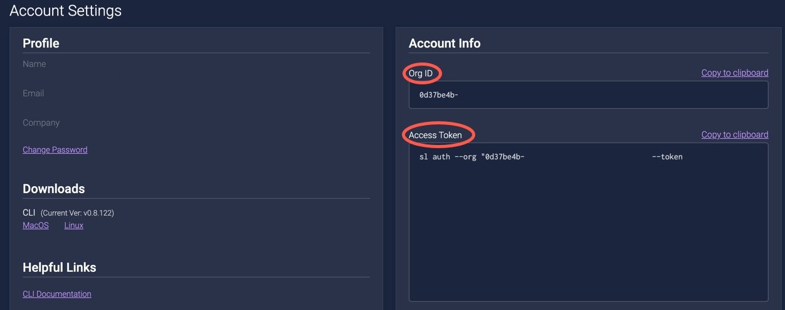

# Integrating with Travis

Travis CI is a hosted continuous integration service used to build and test software projects hosted at GitHub. You can integrate your Travis project with ShiftLeft Inspect for automated code analysis. To do so, configure each Travis project to execute the ShiftLeft Inspect shell command [`sl analyze`](../inspect/analyzing-applications.md).

## Travis Integration Prerequisites

The prerequisites for integrating Travis application builds are:

- [Travis installation](https://travis-ci.org/).
- [ShiftLeft requirements](../../introduction/requirements.md).
- Familiarity with [ShiftLeft Inspect](../../using-inspect-protect/inspect-protect-quick-start.md).
- ShiftLeft account credentials: **Organization ID** and **Access Token**. When you first log into ShiftLeft, these credentials are provided. Once you have established your account, you can obtain your Organization ID and Access Token from the [**Account Settings** page of the ShiftLeft Dashboard](https://www.shiftleft.io/user/profile).




## Travis Integration Options

You can integrate Travis builds with ShiftLeft by either configuring the yaml file or by customizing the container.

### Configuring the `travis.yml` File

This method can be used with both the hosted and on-prem Travis versions.

The typical approach is to configure the CLI installation and `sl analyze` using the `travis.yml` file, which means you can use either the hosted or on-prem edition of Travis.

An example of the `travis.yml` file that demonstrates how to integrate ShiftLeft with Travis is

```yaml
language: java
dist: trusty

install:
  - <INSTALL CLI TOOL> 
  - <any other dependency install steps>
after_install:
  - <RUN CLI & AUTHENTICATE (if not using environment variables, see note below)>
script:
 - run your tests here
 - or any other tasks
after_script:
 - <RUN CLI & EXECUTE COMMAND sl analyze> 
```

See the [Travis documentation](https://docs.travis-ci.com/user/environment-variables#Default-Environment-Variables).

### Customizing the Container

This method can only be used with Travis Enterprise (on-prem) version.

Each Travis build uses an ephemeral Linux container (Docker). If desired you could modify the build containers to do the `install` (CLI installation) and `after_install` (`analyze`) steps. This involves editing the Dockerfile as described in the [Travis documentation](https://docs.travis-ci.com/user/enterprise/build-images/#Customizing-build-images).

**Note**: Modifying the build container is a Travis Enterprise (on-prem) feature only; you cannot modify the build container using hosted Travis.
