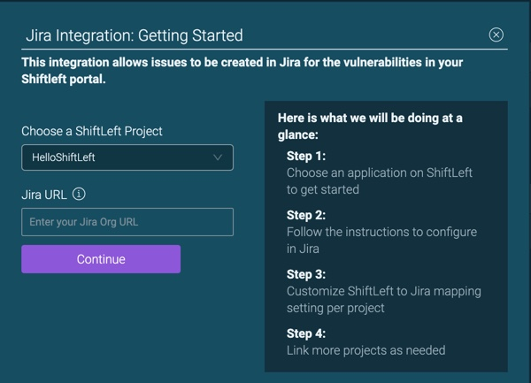
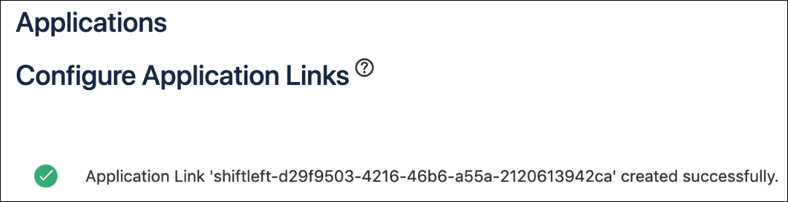

# Integrating with Jira

You can integrate Jira with ShiftLeft to create Jira tickets for the vulnerabilities shown on your [ShiftLeft Dashboard](../using-dashboard/vulnerability-dashboard.md). The process is:

1. [Make sure you meet all requirements](#requirements).
2. [Establish the connection between ShiftLeft and Jira](#establishing-the-connection-between-shiftleft-and-jira). 
3. [Configure ShiftLeft and Jira](#configuring-shiftleft-and-jira).
4. [Enable Two-way Integration](#enabling-two-way-integration).
5. [Create Jira Tickets from the ShiftLeft Dashboard](#creating-jira-tickets-from-the-shiftleft-dashboard).

Once you have integrated ShiftLeft with Jira for one application, you can [integrate additional applications](#integrating-additional-applications-with-jira) you are analyzing and/or securing using ShiftLeft.

Note that ShiftLeft only populates with information standard Jira fields; custom Jira fields are not integrated.

## Requirements

* Jira user must be in the *jira-administrators* group.
* At least one Jira project for which you want to use ShiftLeft to create tickets.
* At least one application you want to analyze and/or secure with ShiftLeft. 

## Establishing the Connection between ShiftLeft and Jira

1. [Log into your ShiftLeft account](https://www.shiftleft.io/login).

2. Open the Integrations page by clicking on the Settings icon on the Toolbar.

   

3. Select Jira from Available Integrations by clicking on the associated **+** icon.

   

4. Using the resulting dialog, choose the application you are analyzing and/or securing with ShiftLeft for which you want to enable Jira integration .

   
   
5. Enter your Jira Org URL. The URL should be similar to https://<i></i>shiftleft.atlassian.net.

6. Click **Continue**.

## Configuring ShiftLeft and Jira

Configuring involves first creating a link from Jira to ShiftLeft, and then allowing the Jira link from ShiftLeft.

### Creating a Link from Jira

1. From Jira, in a new tab, open the **Configure Application Links** page.

   

2. From the ShiftLeft page, copy the **ShiftLeft Application URL** and paste it in the Jira **Configure Application Links** field, and then click **Create new link**.

   

   If you receive a “No response…” message, it can be ignored since the integration will still work. Just click **Continue** to dismiss this message.

   

3. In the Jira Link Applications page, enter the appropriate information in the fields using the corresponding values from the ShiftLeft page. Check **Create incoming link**, and then click **Continue**.

   

4. In the following Jira page, enter the appropriate information in the three fields and click **Continue**.

   A confirmation dialog indicates that the Application Link is successfully created.

   

### Allowing the Jira Link from ShiftLeft

1. From the ShiftLeft page click **Continue**.

2. Click **Allow** to enable ShiftLeft to have read and write access to your Jira project. 
(Note: Clicking **Deny** disrupts the integration flow and may require support from ShiftLeft).

   

## Enabling Two-Way Integration

Existing Jira issues can not be displayed in the ShiftLeft Dashboard. However, once a Jira ticket is created for a ShiftLeft  vulnerability, any and all changes to that particular Jira ticket is automatically updated in the ShiftLeft Dashboard.

1. From Jira, choose the project for which you want to create tickets from ShiftLeft. 

2. Select your **Default Priority** and **Default State** settings.

   **Default Priority**. The priority of the Jira ticket according to the ShiftLeft severity definition.
   **Default State**. How ShiftLeft treats any state change for Jira tickets.

3. Specify how the ticket should be displayed in Jira (ex: Bug, Task, Epic, etc).

4. Click **Continue** to save and complete the two-way integration.
   You can change these settings at any time from  the Manage Integration page.

   

## Creating Jira Tickets from the ShiftLeft Dashboard

Once Jira Integration is enabled, you create Jira tickets from the ShiftLeft Dashboard.

* From the ShiftLeft Vulnerability Info page for a specific vulnerability, click **Send to Jira**.

A message confirms that a Jira ticket is now linked to that specific vulnerability. 

Status changes in Jira are automatically reflected on the ShiftLeft Dashboard.

## Integrating Additional Applications with Jira

Once you have integrated ShiftLeft with Jira for one application, you can integrate additional applications you are analyzing and/or securing using ShiftLeft.

1. From ShiftLeft, open the Integrations page by clicking on the Settings icon.

2. Click on the + icon associated with the application for which you want to enable Jira integration.

3. Click **Allow** to enable ShiftLeft to have read and write access to your Jira project.

4. [Enable Two-way Integration](#enabling-two-way-integration).
