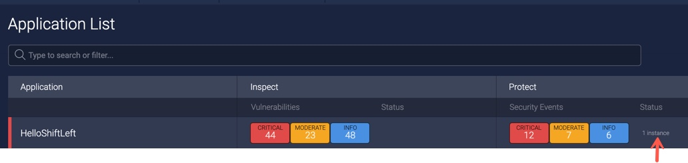

# Running ShiftLeft Protect

Before using ShiftLeft Protect, make sure you have met all [product requirements](../../introduction/requirements.md#requirements-for-shiftleft-protect) and are [authenticated to your ShiftLeft tenant](../using-cli/authenticating.md).

You use the [ShiftLeft Command Line Interface (CLI)](../using-cli/cli-reference.md) to run ShiftLeft Protect. Running ShiftLeft Protect requires previous analysis of the target application using [ShiftLeft Inspect](../../introduction/products.md). This allows ShiftLeft Protect to generate instrumentation custom tailored to the specific version of your application. Once ShiftLeft Protect is running, you should [verify connectivity](#verifying-connectivity).
You may also want to [configure ShiftLeft Protect](protect-java/configuring-the-microagent.md) for your environment.

Running ShiftLeft Protect for Java applications is different than for .NET Framework applications. 

## Running ShiftLeft Protect with Analysis Before Runtime

For both Java and .Net Framework application, you analyze your code as a separate step **before** runtime, allowing installation in a build / Continuous Integration (CI) environment. For Java applications only, you have the option of instead [performing analysis **at** runtime](#running-shiftleft-protect-for-java-with-analysis-at-runtime).  

When you analyze your application as a seperate step before using ShiftLeft Protect, you must include the [ShiftLeft JSON file](json-file.md) (generated by ShiftLeft Inspect) with the target application you are deploying. 

Once your analysis is complete, run ShiftLeft Protect using the command 

```
sl run --app <name> 
```

where

`--app <name>`. Specifies your application's unique name.

## Running ShiftLeft Protect for Java with Analysis at Runtime

For Java applications only, you can analyze your code at runtime. When analyzing at runtime, ShiftLeft first submits your application to the cloud for analysis. If analysis has previously been performed on this version of the application, then no further analysis is required and your application is started immediately. Otherwise, analysis takes place before starting ShiftLeft Protect, and therefore it may take a few minutes for your application to start.

Use the command

```
sl run \
  --app <name>\
  --analyze target/<jar> \
  -- java -jar target/<delimits flags>
```

where

`--app <name>`. Specifies your application's unique name.

`--analyze <jar>`. Points to your application's JAR.

`--`. Delimits flags from the command to be wrapped. 

For example:

```bash
sl run --analyze <file.jar> --app hello-shiftleft -- java -jar target/hello-shiftleft-0.0.1.jar
```

### Using the -javaagent JVM Flag

If wrapping your application command line with `sl run` is not an option for you, then it is possible to instruct the JVM to run ShiftLeft Protect by using the Java flag `-javaagent:<path-to-microagent-jar>`.

Note that passing the `javaagent` flag directly skips ShiftLeft Protect's automatic update mechanism. In this situation, it is strongly recommend to use the command

```bash
sl update java-agent
```

Make sure that every time before starting your application, you have the latest version of the Microagent. Use the `~/.shiftleft/sl-microagent-latest.jar` symlink, to point to the latest downloaded version of the  Microagent. For example

```bash
# Optionally analyze app (if not analyzed before)
sl analyze --wait --app example-app exampleapp.jar
# Auto-update ShiftLeft Microagent.
sl update java-agent
# Run application with ShiftLeft Microagent.
java -javaagent:~/.shiftleft/sl-microagent-latest.jar -jar exampleapp.jar
```

## Running ShiftLeft Protect for .NET Framework Applications

For .NET Framework 64-bit applications, the required ShiftLeft Inspect code analysis must be performed as a [separate step before running ShiftLeft Protect](#running-shiftleft-protect-with-analysis-before-runtime). In addition, make sure you are running on a Windows operating system that has at least .NET Framework Runtime 4.5 installed. 

If you are running ShiftLeft Protect with Internet Information Services (IIS), first copy the [`shiftleft.json` file](json-file.md) (that was generated by ShiftLeft Inspect during analysis) into the `C:\shiftleftDotNetAgent\spr` directory. You can then start sending requests to your application in the usual manner (e.g., through a browser or a script). The ShiftLeft Protect Microagent is activated once your application receives its first request.

If you are running ShiftLeft Protect with IIS Express, start the application through the ShiftLeft CLI as follows:

```
"C:\Program Files\Shiftleft\sl.exe" run --csharp "C:\Program Files\IIS Express\iisexpress.exe" <full path to the project location>
```
You can then send requests to the target application using the method of your choice, such as a browser or a utility like curl. For IIS Express, your application runs on port 8500, for example curl http://<span></span>localhost:8500/vulnerable_asp_net_framework.

## Verifying Connectivity

ShiftLeft Protect is connected when the [ShiftLeft Dashboard](../using-dashboard/vulnerability-dashboard.md) shows the number of Instances for your application. 


