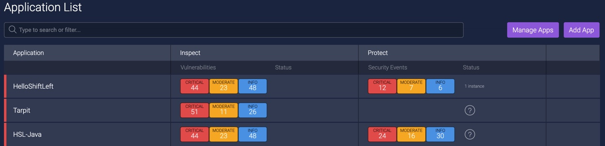
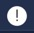
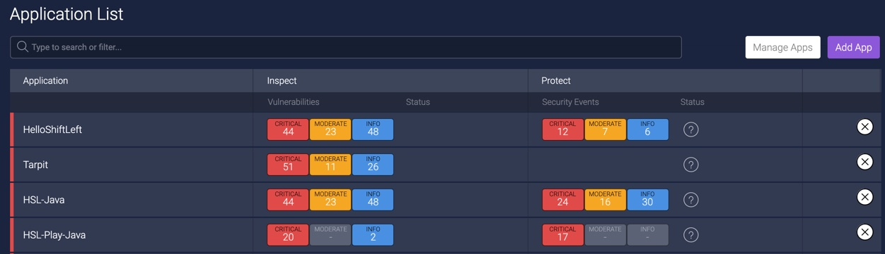

# The Application List

The Application List is your entry point into the ShiftLeft UI, which displays security quality metrics and vulnerabilities resulting from ShiftLeft's static analysis and/or runtime monitoring of your applications. 

The Application List provides:

* [Access to the global Vulnerabilities Dashboard](#accessing-the-global-vulnerabilities-dashboard)
* [Snapshot of information on your applications](#snapshot-of-information-on-your-applications)
* [Drill down on an application](#drilling-down-on-an-application)
* [Deleting an application from ShiftLeft](#deleting-an-application-from-shiftleft)
* [Adding an application to ShiftLeft](#adding-an-application-to-shiftleft)

## Accessing the Global Vulnerabilities Dashboard

Clicking **Vulnerabilities** from the Application List displays the [Vulnerabilities Dashboard](vulnerability-dashboard.md) for **all** your applications. 

## Snapshot of Information on Your Applications

The Application List provides a snapshot of information on your applications. You can immediately see the list of applications in ShiftLeft, the number and type of vulnerabilities for each application discovered by ShiftLeft Inspect, and if applicable, the number and type of security events identified for an application by ShiftLeft Protect.

### Status

The Application List also displays, in the Status column, icons that indicates the status of your application's analysis and runtime monitoring.

Icon | Description
--- | ---
 | Denotes a message. Hovering on the exclamation point displays information on [analysis results](view-results.md#status-of-analysis-results).
 | Identifies an application that is currently not being monitored and secured by ShiftLeft Protect, and therefore does not include up-to-date information on the number and type of security events for the application.
 | Indicates that an application is still being analyzed.
 | Shows that there are partial results for an application.
 | Indicates the analysis of an application has failed.

## Drilling Down on an Application

To find a specific application in your Application List, or to narrow the applications displayed, use the **search or filter** field.

To see information on a specific application, click on the application of interest from the Application List. The [Vulnerabilities Dashboard](vulnerability-dashboard.md) for that application is opened. 

## Deleting an Application from ShiftLeft

To delete an application from ShiftLeft:

1. Click **Manage Apps**.

   A x appears for each application in the list.
   
   
   
2. Click on the x associated with the application you want to delete.

## Adding an Application to ShiftLeft

To add an application to ShiftLeft:

1. Click **Add App**.

   A page with instructions on how to add the application is displayed.
   
2. [Use the Welcome page to specify the application you want to add to ShiftLeft](../inspect-protect-quick-start.md).
