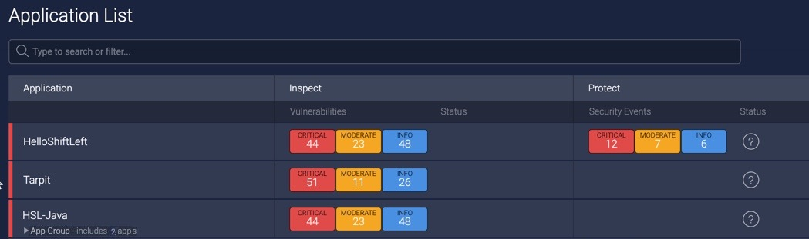
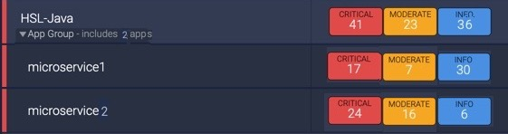
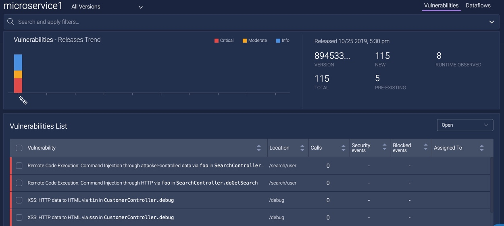
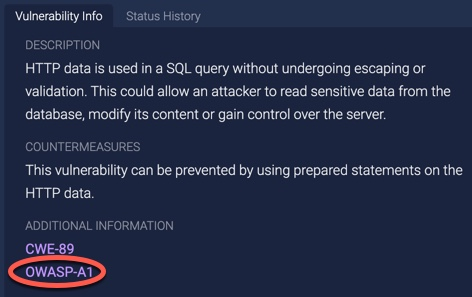
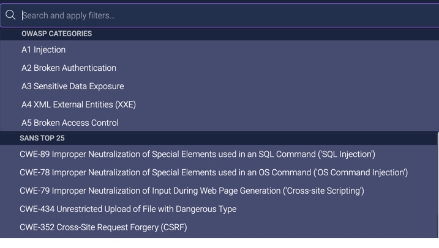
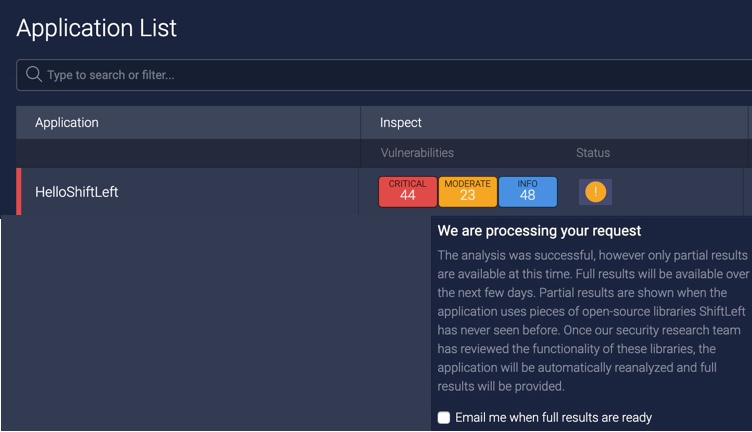
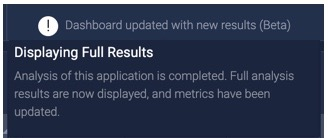

# Viewing Analysis Results

The ShiftLeft Dashboard provides information on:

* [Grouped applications](#grouping-application-results)
* [Results by branch name](#displaying-results-by-branch-name)
* [Top OWASP and SANS Vulnerabilities](#identifying-and-getting-additional-information-on-top-owasp-and-sans-vulnerabilities)
* [Status of analysis results](#status-of-analysis-results)

## Grouping Application Results

Application groups are useful for viewing vulnerabilities across multiple associated microservices in a single Dashboard view. Each microservice is still analyzed individually, and vulnerabilities are identified by individual microservice.

In order to create a group of applications, use the CLI command [`sl analyze --tag app.group=<name>`](../using-cli/cli-reference.md). You can add a microservice to multiple application groups, by repeating this command.

A grouped application can be searched for and selected from the **search or filter** field, and is displayed on the [Applications List](app-list.md) by the group name you specified.

A grouped application is identified by the **App Group** label, indicates the total number of applications in the group, and allows you to view information on each individual application by clicking on the expand arrow.

Clicking on the application group displays the Vulnerabilities Dashboard for the entire group. The location of each vulnerability is shown. Clicking on an individual application displays the Vulnerabilities Dashboard for that specific application.

## Displaying Results by Branch Name

If you have [included branch names from your SCM system in the analysis results of ShiftLeft Inspect](../inspect/identify-branches.md), you can view analysis results of individual branches separately. To do so, 

1. From your application's [Vulnerabilities Dashboard](../using-dashboard/vulnerability-dashboard.md), click in the **All Versions** field.

   

2.  Select the application version whose results you want to see from the drop-down menu. Choosing **All Versions** shows the results of all branches of the application in a single view.

## Identifying and Getting Additional Information on Top OWASP and SANS Vulnerabilities

The [OWASP](https://www.owasp.org/index.php/Category:OWASP_Top_Ten_Project) and [SANS](https://www.sans.org/top25-software-errors/) organizations provide information on the most widespread and critical errors that can lead to serious security vulnerabilities in your software. 

Vulnerabilities found by ShiftLeft Inspect that are either OWASP Top 10 or the SANS Top 25 are identified as such. To drill-down on a Top OWASP or SANS vulnerability:

1. From your application's [Vulnerabilities Dashboard](../using-dashboard/vulnerability-dashboard.md), click on the vulnerability of interest.

2. In the **Vulnerability Info** tab of the Vulnerability Detail view, the **Additional Information** section indicates whether the vulnerability is a Top OWASP or SANS. You may need to scroll down to see the Additional Information section. 

3. Click on the tag to display, in a separate tab, specific information on this vulnerability from the appropriate organization.

You can also [filter for Top OWASP and SANS vulnerabilities](filter-results.md).

## Status of Analysis Results

When you submit an application referencing a part of a library ShiftLeft has not seen before, it may take ShiftLeft Inspect additional time to complete a full analysis. In those situations, ShiftLeft Inspect initially displays the partial analysis results, which are indicated by an exclamation point associated with the application in the Application List and in the application's Vulnerabilities Dashboard. Hovering over the exclamation point displays a message.

 

From this message, you can confirm if you want to receive notification when the full analysis results are available. Just check the box to **Email me when full results are ready**. 

Once ShiftLeft Inspect completes the analysis, the message changes to indicate that the full analysis results are now displayed and all metrics have been updated.

