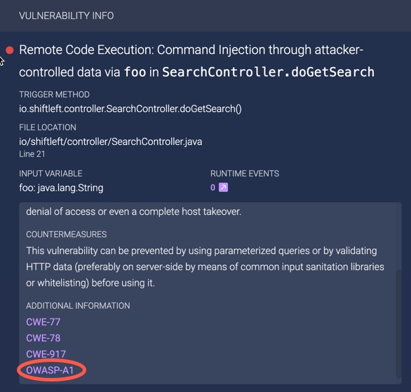
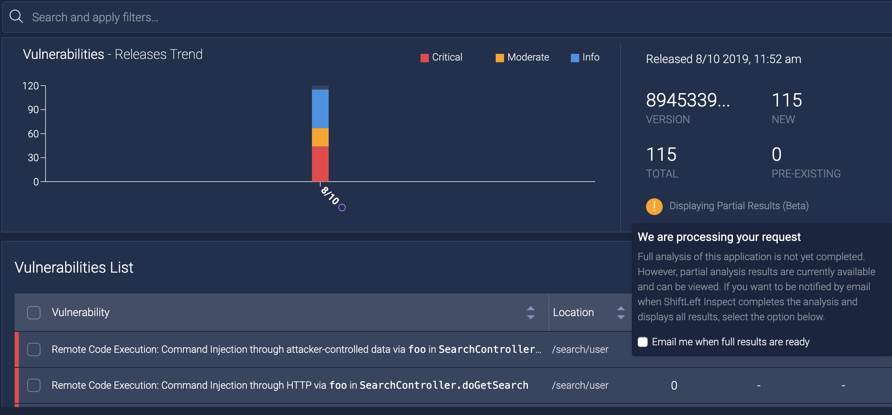

# Viewing Analysis Results

The [Vulnerabilities Dashboard](vulnerability-dashboard.md) provides information on:

* [Results by branch name](#displaying-results-by-branch-name)
* [Top OWASP and SANS Vulnerabilities](#identifying-and-getting-additional-information-on-top-owasp-and-sans-vulnerabilities)
* [Analysis results](#analysis-results-notification)

## Displaying Results by Branch Name

If you have [included branch names from your SCM system in the analysis results of ShiftLeft Inspect](../inspect/identify-branches.md), you can view analysis results of individual branches separately. To do so, 

1. From your application's [Vulnerabilities Dashboard](../using-dashboard/vulnerability-dashboard.md), click in the **All Versions** field.

   

2.  Select the application version whose results you want to see from the drop-down menu. Choosing **All Versions** shows the results of all branches of the application in a single view.

## Identifying and Getting Additional Information on Top OWASP and SANS Vulnerabilities

The [Open Web Application Security Project (OWASP)](https://www.owasp.org/index.php/Category:OWASP_Top_Ten_Project) and [SANS](https://www.sans.org/top25-software-errors/) organizations provide information on the most widespread and critical errors that can lead to serious security vulnerabilities in your software. 

Vulnerabilities found by ShiftLeft Inspect that are either OWASP Top 10 or the SANS Top 25 are identified as such in the Additional Information section of the [Vulnerability Description](../using-dashboard/vulnerability-dashboard.md). You may need to scroll down to see the Additional Information section. 

Clicking on the tag displays, in a separate tab, specific information on this vulnerability from the appropriate organization.

You can also [filter for Top OWASP and SANS vulnerabilities](filter-results.md).

## Analysis Results Notification

When you submit an application referencing a part of a library ShiftLeft has not seen before, it may take ShiftLeft Inspect additional time to complete a full analysis. In those situations, ShiftLeft Inspect initially displays the partial analysis results, which are indicated by a message associated with the application in the Application List and in the application's  Vulnerabilities Dashboard. 

 

From this message, you can specify that you want to receive notification when the full analysis results are available. Just check the box to **Email me when full results are ready**. 

Once ShiftLeft Inspect completes the analysis, the message changes to indicate that the full analysis results are now displayed and all metrics have been updated.

