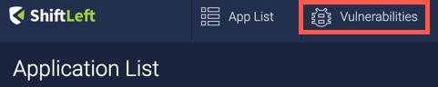
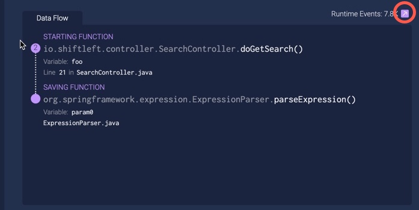

# The Vulnerabilities Dashboard: Measure Security Quality of Releases over Time

The Vulnerabilities Dashboard is a singular view of application security quality metrics, providing a list of vulnerabilities based on ShiftLeft Inspect's static analysis and/or ShiftLeft Protect's runtime monitoring of your application. Engineering and SecOps teams can use these metrics to measure the progress of their security improvement over time.

The Vulnerabilities Dashboard offers the following types of information:

* [Progressive build (security) quality](#progressive-build-quality)
* [Security regression testing](#security-regression-testing)
* [Runtime observed vulnerabilities](#runtime-observed-vulnerabilities)
* [Vulnerability information](#vulnerability-information)
* [Event details](#event-details)

The list of vulnerabilities can be filtered and sorted on multiple criteria including:

* severity, type and category of vulnerabilities
* location
* number of calls, security events, and blocked attempts
* to whom the vulnerability is assigned

Filters can also be [saved and reused](filter-results.md), and as the [basis for a build rule](../inspect/fail-build.md).

You access the Vulnerabilities Dashboard from your [Applications List](app-list.md). Clicking **Vulnerabilities** displays the Vulnerabilities Dashboard with a list of vulnerabilities for **all** your applications. 

To see a specific application's vulnerabilities, click on the application of interest from your Applications List.

## Progressive Build Quality

Progressive build (security) quality is measured by the number of vulnerabilities fixed in the nth build vs n-1 build. You can perform custom comparisons between any two builds. This helps measure progress (or decline) of security quality between releases.

## Security Regression Testing

ShiftLeft reports the number of new vulnerabilities and reintroduced vulnerabilities in the latest build, so that engineering leaders can measure how many security issues escaped regression testing.

## Runtime Observed Vulnerabilities

The Vulnerabilities Dashboard reports the number of vulnerabilities that have associated runtime traffic events in QA test or production. This measure can help developers prioritize vulnerabilities, and to use the criticality of the vulnerabilities. Reduction in the number of runtime observed vulnerabilities is highly correlated with reduction in number of application exploit attempts over time.

## Vulnerability Information

From the Vulnerabilities List, click on a vulnerability of interest to see the following information:

* Data Flow (associated with the vulnerability)
* Runtime Events (i.e. the number of times the vulnerability was observed in runtime)
* Vulnerability Info
* Status History

From the Vulnerability Detail view, developers and security teams can take action on the vulnerability by:

* Clicking **Assign** to assign the vulnerability to a particular person.
* Marking the vulnerability as **Fixed**.
* Clicking **Ignore** to indicate that the vulnerability should be ignored.

## Event Details

The Event Viewer shows details on a sampling of security events for a vulnerability. Display the Event Viewer by clicking on the arrow associated with Runtime Events in the Vulnerability Detail view.  

The Event Viewer has a maximum of 50 evenly distributed event samples, collected from when the vulnerability was first identified. Details are provided on an event's headers, payloads, request origin, and whether the event was blocked by ShiftLeft Protect. Such information can help you in remediation, to make precise code fixes and to determine the extent of an attack. 

Note that by default the Event Viewer only displays an event count summary. In order to include the full payloads of attack events, you must turn on the CLI Flag [sec.collect.attack.info](../protect/protect-java/configuring-the-microagent.md#collect-attack-information). User opt-in is required because collected event information is potentially sensitive, and consumes more network resources to transmit that data to the ShiftLeft infrastructure.
