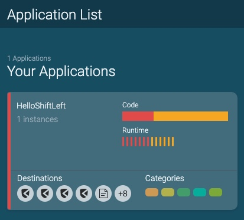
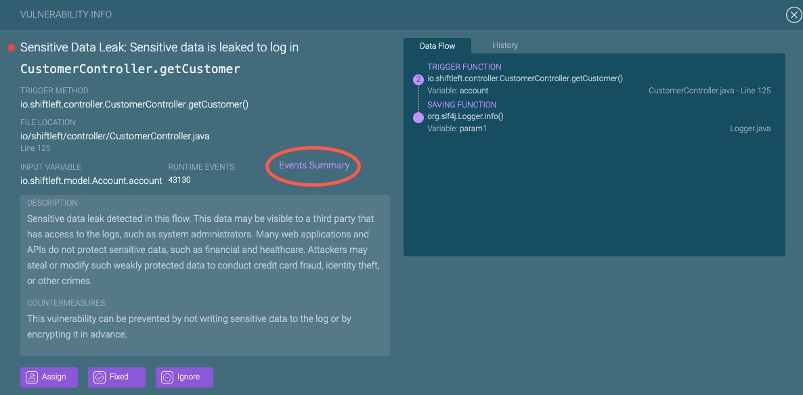
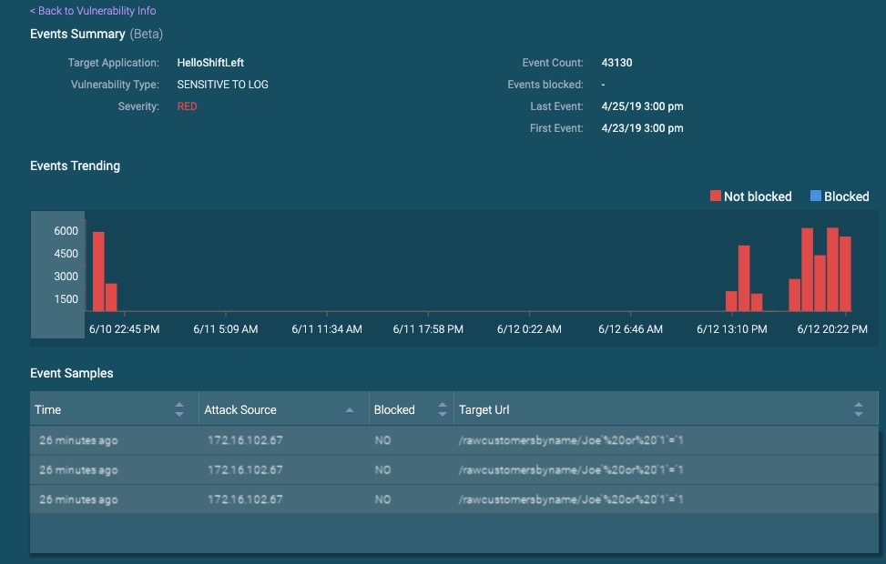

# The Vulnerabilities Dashboard: Measure Security Quality of Releases over Time

The Vulnerabilities Dashboard is a singular view of application security quality metrics, including a list of vulnerabilities based on static/runtime analysis of applications. Engineering and SecOps teams can use these metrics to measure the progress of their security improvement over time.

The Vulnerabilities Dashboard offers four types of information:

* [Progressive build (security) quality](#progressive-build-quality)
* [Security regression testing](#security-regression-testing)
* [Runtime observed vulnerabilities](#runtime-observed-vulnerabilities)
* [Vulnerability characteristics](#vulnerability-characteristics)
* [Event details](#event-details)

In addition, the Vulnerabilities Dashboard provides a list of vulnerabilities that can be filtered and sorted on multiple criteria including severity, location of the vulnerabilities, number of security events, and number of blocked attempts to exploit the vulnerability.

You access the Vulnerabilities Dashboard by clicking on the card of the application of interest, from the Application List Dashboard > Your Applications view.

## Progressive Build Quality

Progressive build (security) quality is measured by the number of vulnerabilities fixed in the nth build vs n-1 build. In general, one could perform custom comparisons between any two builds. This helps measure progress (or decline) of security quality between releases.

## Security Regression Testing

ShiftLeft reports the number of new vulnerabilities and reintroduced vulnerabilities in the latest build, so that engineering leaders can measure how many security issues escaped regression testing.

## Runtime Observed Vulnerabilities

The Vulnerabilities Dashboard reports the number of vulnerabilities that have associated runtime traffic events in QA test or production. This measure can help developers prioritize vulnerabilities, and to use the criticality of the vulnerabilities. Reduction in the number of runtime observed vulnerabilities was highly correlated with reduction in number of app exploit attempts over time.

## Vulnerability Characteristics

From the vulnerabilities list, click on a vulnerability of interest to see information on the following characteristics:

* trigger method
* file location
* input variable
* number of times vulnerability was observed in runtime
* recommended countermeasure
* data flow associated with the vulnerability

Developers and Application security teams can use this information to take action on a particular vulnerability.

## Event Details

You can view details on a sampling of security events for a vulnerability, by clicking on Events Summary from the Vulnerability Info view.  

Displays a maximum of 50 evenly distributed event samples, collected from when the vulnerability was first identified. Details are provided on an event's headers, payloads, request origin, and whether the event was blocked by ShiftLeft Protect. Such information can help you in remediation, to make precise code fixes and to determine the extent of an attack. 

Note that by default the Event Viewer only displays an event count summary. In order to include the full payloads of attack events, you must turn on the CLI Flag [sec.collect.attack.info](../using-inspect-protect/protect-java/configuring-the-microagent.md#collect-attack-information). User opt-in is required because collected event information collected  potentially sensitive, and consumes more network resources to transmit that data to the ShiftLeft infrastructure.
