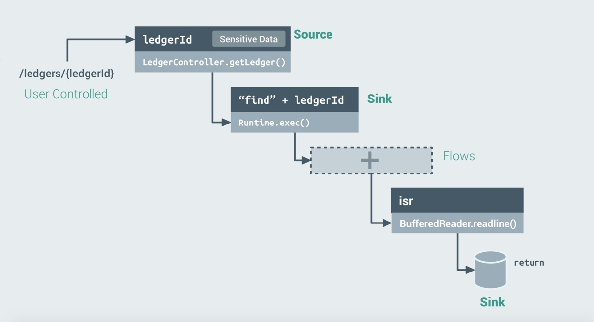

# Uncovering Data Flows

Using [HelloShiftLeft](../../introduction/helloshiftleft.md), a sample application, this tutorial shows 
how to uncover data flows in your application. 

Upon identifying interesting methods, such as methods that 
* take user controlled inputs (eg. HTTP handlers)
* transform data (serilaize, deserialize) 
* act on the data (loggers, spawn a process, store data in DB etc.)

it is possible to identify how data flows between methods. Assigning some methods as sources, and others as sinks, helpt to 
find flows between them. An illustration of a typical sources and sinks in HelloShiftLeft application is



## Finding Flows from Source to Sink

This query creates a temporary variable (`source`) and assign to it all the parameters of all methods
named `getLedger`. These parameters all can now act as sources.

```
ocular> val source = cpg.method.name("getLedger").parameter
```

The following query creates a temporary variable (`sink`) and assign to it all the parameters of all methods containing `Runtime` and `exec` in their full name.

```
ocular> val sink = cpg.method.fullName(".*Runtime.*exec.*").parameter
```

Note that the above source and sink are parameters to methods, since the goal is to taint and track the data being transformed and passed between them. Parameters can now be used to discover flows within the HelloShiftLeft application.

The query prints all the flows (`f`) reachable by the method parameters `source` from the methods parameters `sink`.


## Finding Flows from a Sink to Source

With ShiftLeft Ocular, it is actually possible to traverse back from a source to a sink. For cases in which there might be multiple flows, use `.caller` construct on the `sink` method repeatedly until a source function is reached that satisfies 
the traits of interest.

For the given `sink` (a method having a name with `Runtime` and `exec` in its full name), the query recursively find its calling methods (`.caller`) until a method is reached that is accessible from outside (`isPublic`), and has at least one parameter of the type `java.Lang.String` which is the required `source`.

```
ocular> cpg.method.fullName(".*Runtime.*exec.*").repeat(m=>m.caller).until(m=> m.isPublic.parameter.evalType("java.lang.String")).emit().fullName.l
res38: List[String] = List( "io.shiftleft.controller.LedgerController.getLedger:java.lang.String(java.lang.Long)"
)
```
