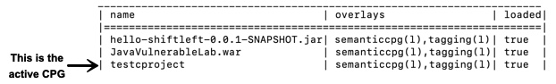

# Managing Your Workspace

A workspace is a container for all data persisted by ShiftLeft Ocular (on disk and in memory). Workspaces allow you to easily work with CPGs and Security Profiles, load and simultaneously work with more than one CPG, and combine queries. 

Your workspace is created the first time you use ShiftLeft Ocular to create a CPG. 

## Viewing the Contents of Your Workspace

To view the contents of your workspace, use the command

```scala
ocular> workspace
```

Information on the CPGs and their associated layers in the workspace, and whether the CPG and layers are loaded into memory, is displayed.


## Determining the Active CPG

By default, all operations are executed on the CPG that was last loaded into memory; this is the active CPG. You can determine the active CPG by viewing the contents of your workspace using the command `ocular> workspace`. The CPG at the bottom of the list is the active CPG.



## Resetting Your Workspace

To clear out your workspace, removing all CPGs and layers from memory and disk, use

```scala
ocular> workspace.reset
```

## Resetting The Current CPG

If a CPG is currently loaded, the below command allows resetting only that single CPG in order to recreate it: 

```scala
ocular> workspace.deleteCurrentRecord
```
