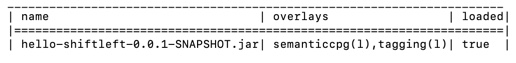

# Working With Control Property Graphs (CPGs)

You work with existing CPGs, and their associated layers, in your workspace. A workspace is created when you first create a CPG. It contains all data persisted by ShiftLeft Ocular. 

Working with CPGs involves:

* [Loading a CPG into your workspace](#loading-a-cpg-into-your-workspace)
* [Unloading a CPG from your workspace](#removing-a-cpg-from-your-workspace)
* [Deleting a CPG from your workspace](#deleting-a-cpg-from-your-workspace)
* [Viewing the contents of your workspace](#viewing-the-contents-of-your-workspace)
* [Loading and adding layers](#loading-and-adding-layers)

By default, all operations are executed on the CPG that was last loaded into the workspace; this is the active CPG.

## Loading a CPG into Your Workspace

When you load an existing CPG into your workspace, its default layers (security profile, semanticcpg and tagging) are also automatically loaded. Additional layers that you may have created need to be specifically loaded with the CPG.

### Loading a Single CPG

To load a single CPG, use the command

```scala
ocular> loadCpg(<name>)
```
where `<name>` is the filename of the application whose CPG you want to load. The format of the CPG is automatically inferred by ShiftLeft Ocular from the application's file extension. 

### Loading Multiple CPGs

To load multiple CPGs into your workspace, use

```scala
ocular> loadCpg(<names>)
```

where `<names>` is a list of filenames of the applications whose CPGs you want to load, separated by commas.

### Loading a CPG with an Additional Layer

You can load a single CPG, with additional layers that you have created, using the command

```scala
ocular> loadCpg(<name>, <overlayNames>)
```

and to load multiple CPGs with additional layers using the command  

```scala
ocular> loadCpgs(<names>), <overlayNames>)
```
where `<names>` a list of filenames of the applications whose CPGs you want to load, and `<overlayNames>` is the name of one or more additional layers you want to load, separted by commas. 
  
Note that the sequence of the layers as listed is meaningful, determining the order by which they are loaded into your workspace. 

## Unloading a CPG from Your Workspace

Unloading a CPG (and its associated layers) from your workspace removes it from memory, but not from disk. When you remove a CPG, the most recently loaded CPG becomes the active CPG.

To unload the active CPG, use the command

```scala
ocular> unloadCpg
```

To unload a specific CPG, use the command

```scala
ocular> unloadCpg(<name>)
```
where `<name>` is the filename of the application whose CPG you want to unload.
  
## Deleting a CPG from Your Workspace

Deleting a CPG (and its associated layers) from your workspace deletes it from memory and from disk. When you delete a CPG, the most recently loaded CPG become the active CPG.

To delete the active CPG, use the command

```scala
ocular> deleteCpg
```

To delete a specific CPG, use the command

```scala
ocular> deleteCpg(<name>)
```
where `<name>` is the filename of the application whose CPG you want to delete.

## Viewing the Contents of Your Workspace

To view the contents of your workspace, use the command

```scala
ocular> workspace
```

Information on the application, its layers and whether the application CPG and layers are loaded into your workspace is displayed.



You can get a list of the layers currently loaded into your workspace by using the command 

```scala
ocular> overlays
```

## Loading and Adding Layers
 
To load an additional layer that you created into your workspace, and add it to the active CPG, use

```scala
ocular> addOverlay(<names>)
```
  
where `<names>` is the name of one or more layers you want to load, separted by commas. 

And to load a layer into your workspace and add it to a specific CPG, use the command 

```scala
ocular> addOverlay(<baseCpg>, <names>)
```
where `<baseCpg>` is filename of the CPG to which you want to add the layer, and `<names>` is the name of one or more layers you want to load, separted by commas. 
