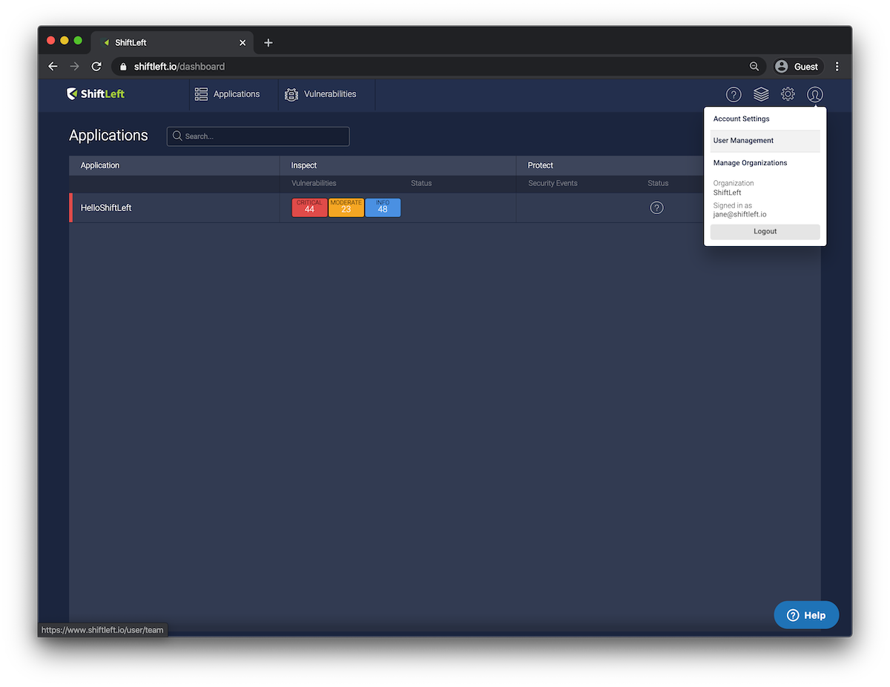
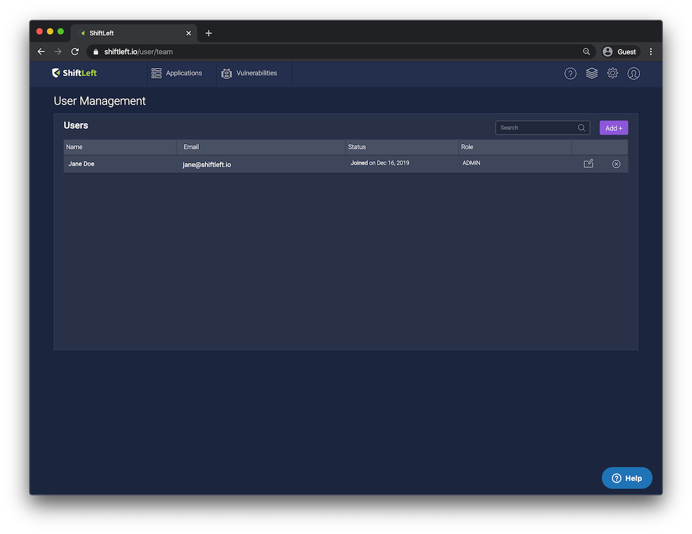
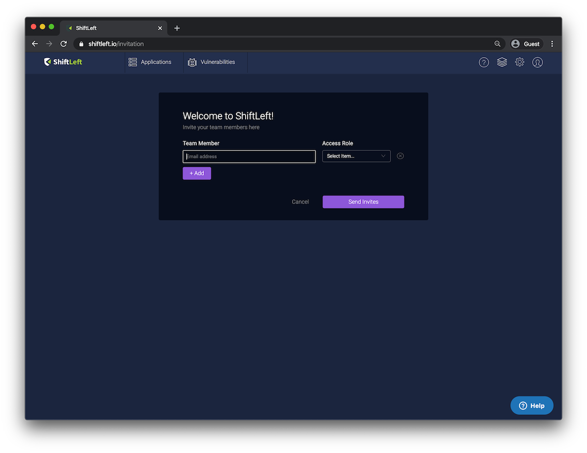
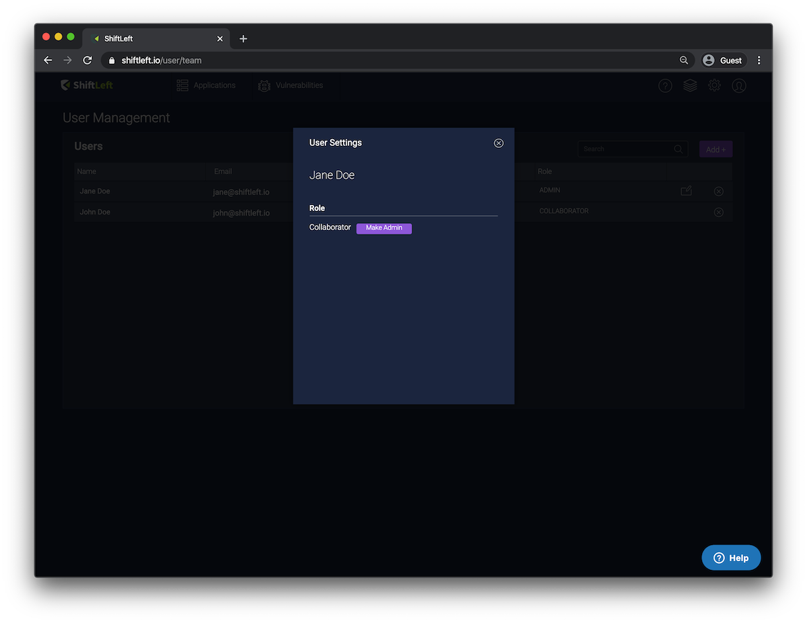

# Manage Users

To manage the users with access to your ShiftLeft account, go to **User** > **User Management**.

You'll be redirected to the User Management page, where you can see a full list of the users that have access to your ShiftLeft account, as well as their **email address**, **status**, and **specific role**.

## Inviting New Users

You can invite new users to access your ShiftLeft account. To do so, click **Add +** on the top-right of the User Management screen to launch the invitation prompt.

Provide the email address for the user you'd like to invite, and set the user's **Access Role**.

Click **Add +** for additional rows if you would like to send out more than one invitation.

When done, click **Send Invites** to proceed. ShiftLeft will send invitation emails to the users you indicated with instructions on how to set up their new accounts and access the ShiftLeft Dashboard.

### Resending Invitations

You can resend an invitation to create a ShiftLeft account to users at any time. To do so:

1. Go to **User** > **User Management**
2. Find the user for whom you want an invitation resent
3. Click the **Resend** link available next to the user's **Status**

## User Roles

Users can be assigned one of two roles.

| **Role** | **Description** |
| - | - |
| **Admin** | Full privileges, including uploading apps, changing the statuses of identified vulnerabilities, managing users, etc. |
| **Collaborator** | Can upload apps for analysis and view analyses for uploaded apps |

## Editing Users

Click the **Edit** icon associated with a user to modify the user. Currently, you can change the user's role from Admin to Collaborator (or vice versa).

